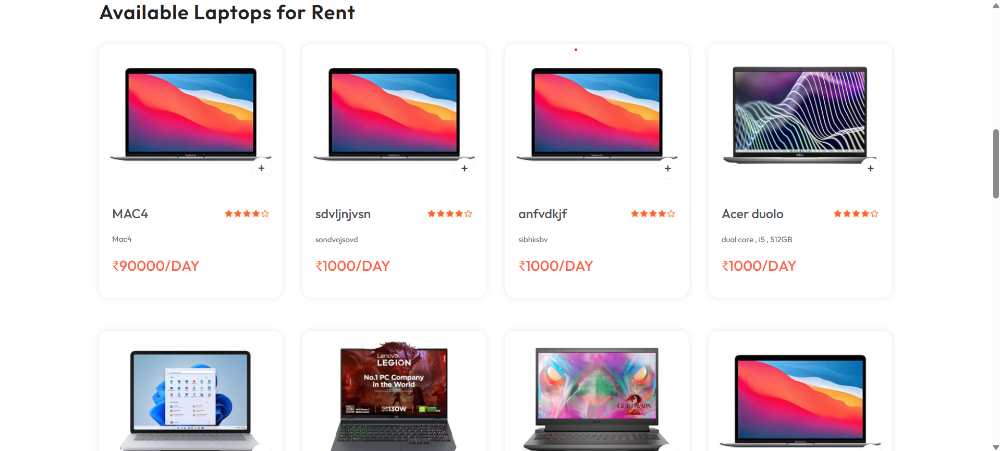

🖥️ RentalVerse
RentalVerse is a web application that allows users to browse, select, and rent laptops for personal or professional use. Designed with user convenience in mind, the platform provides a seamless and secure laptop rental experience.

🚀 Features
🔍 Browse a variety of laptops by brand, specs, or price

🛒 Add laptops to cart and customize rental duration

💳 Secure payment gateway integration

📅 Real-time availability and booking system

👤 User authentication and rental history tracking

⚙️ Admin panel to manage inventory and orders

1

🛠️ Tech Stack
Frontend: React / HTML / CSS / JavaScript

Backend: Node.js / Express

Database: MongoDB

Authentication: JWT-based user login

RentalVerse/
├── frontend/        # Frontend React app
├── backend/        # Backend API
├── admin/        # DB and environment config
└── README.md

Members:

Sakshi Said
Simran Yelave
Adarsh Mishra 
Vamshi Marri 